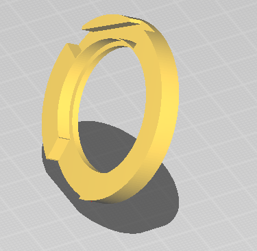

# Alastor_Moody_RP2040-LCD-1.28
This repository includes Alastor Moody eye for costume written for the rounded GC9A01 LCD (RP2040-LCD-1.28) MCU. It is a low-cost, high-performance board designed by [Waveshare][RP2040-LCD-1.28-Wiki].
This project uses gyroscope module to mimic movement of an eye.

 

3D printed model  

**Note:** This device is running with a custom firmware of [gc9a01_mpy][gc9a01_mpy]. [Download][firmware] it and
[flash][raspb-pico-getting-started] it on your device before trying any examples.

[gc9a01_mpy]: <https://github.com/russhughes/gc9a01_mpy>
[firmware]: <https://github.com/russhughes/gc9a01_mpy/tree/main/firmware/RP2>
[raspb-pico-getting-started]: <https://projects.raspberrypi.org/en/projects/getting-started-with-the-pico/3>
[RP2040-LCD-1.28-Wiki]: <https://www.waveshare.com/wiki/RP2040-LCD-1.28>
